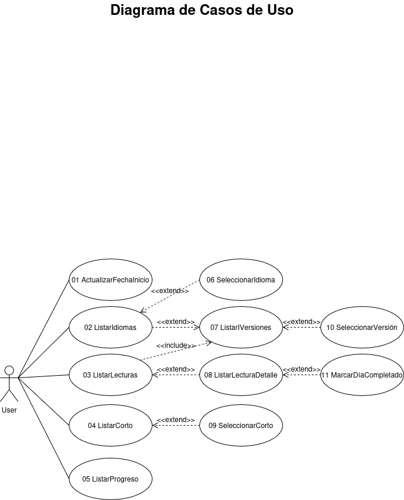
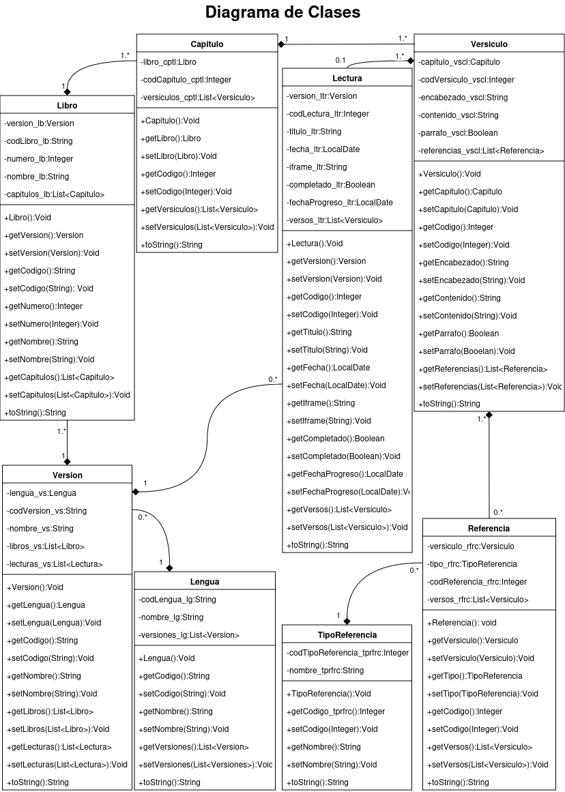
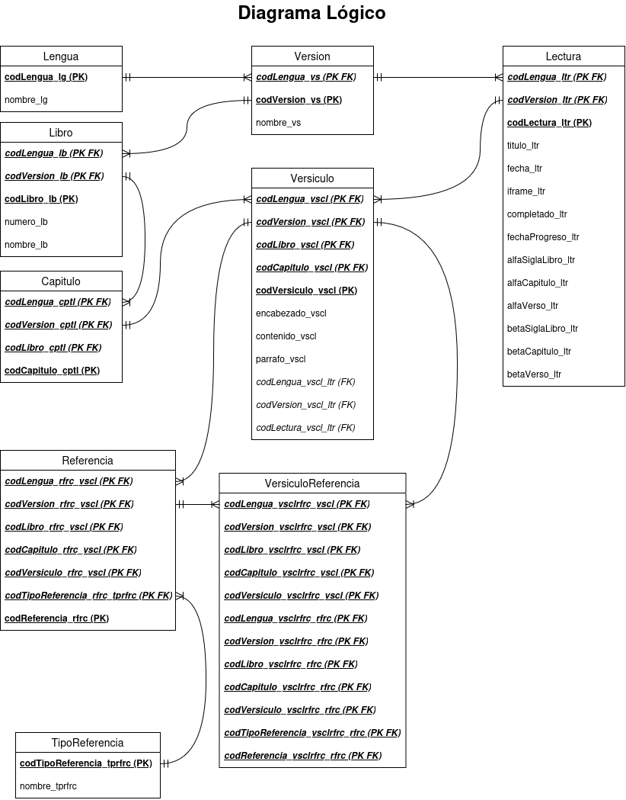
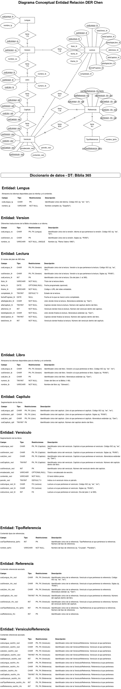
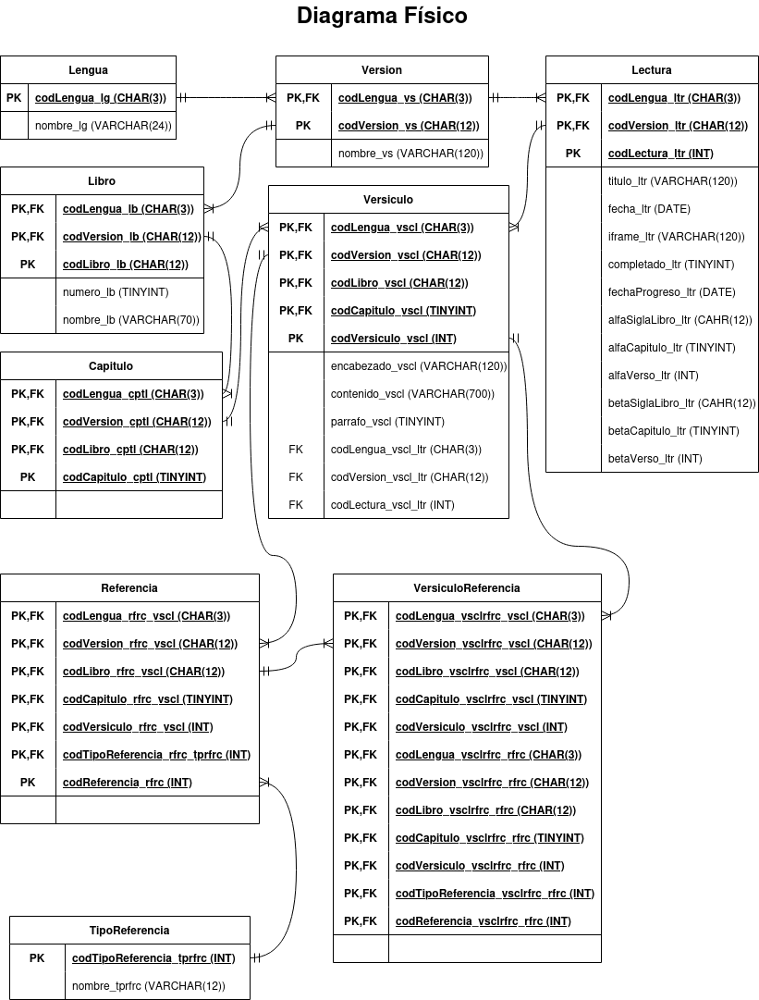
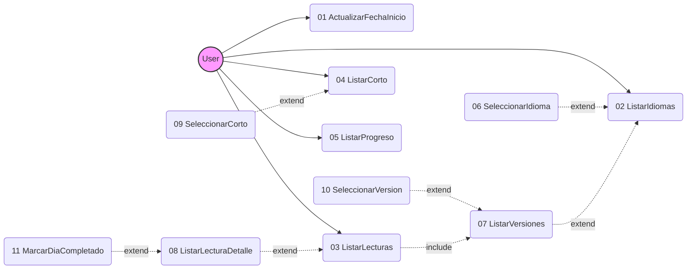
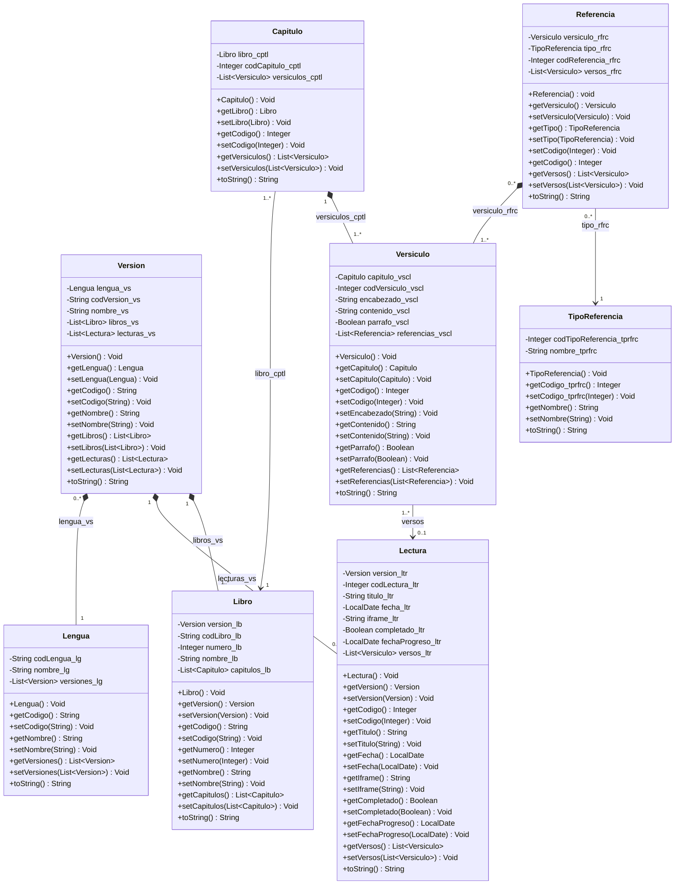
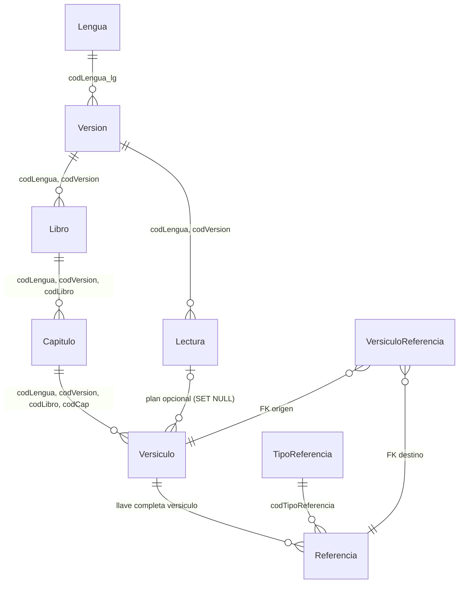
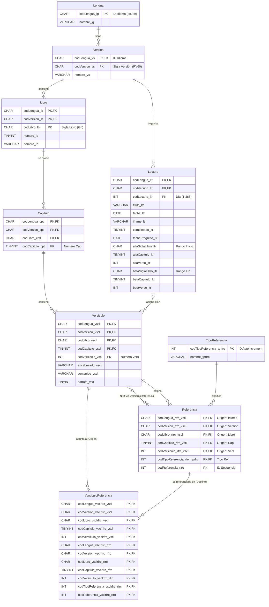
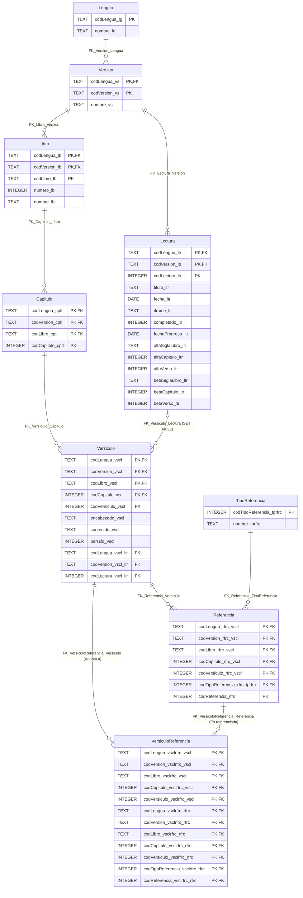

# Contexto del Proyecto Biblia360

## Base de Datos
- El esquema de la base de datos se encuentra en `app/src/main/assets/database_biblia360.sql`.
- La base de datos sigue el plan de lectura de 365 días.
- Se utiliza SQLite con claves foráneas activas (`PRAGMA foreign_keys = ON`).
- La carga inicial de datos (población) se realiza mediante código Java para evitar desbordamientos en la ejecución de scripts SQL extensos.
- La asignación de versículos a cada lectura se realiza mediante un proceso de actualización post-carga que vincula los versículos (FK) basándose en los rangos definidos por los campos alfa y beta de la tabla Lectura.

## Documentación Técnica Visual (Diagramas SVG)

### Diagrama de Casos de Uso

### Diagrama de Clases

### Diagrama Lógico

### Diagrama Conceptual Entidad-Relación Chen (DER Chen)

### Diagrama Físico

## Diagramas Mermaid (Código)

### Diagrama de Casos de Uso

### Diagrama de Clases (Arquitectura de Entidades)

### Diagrama Lógico

### Diagrama Conceptual / Entidad-Relación Chen (Mermaid)

### Diagrama Físico (Mermaid)

## Diccionario de Datos Detallado

### Entidad: Lengua
| Campo | Tipo | Restricciones | Descripción |
| :--- | :--- | :--- | :--- |
| `codLengua_lg` | CHAR | PK | Identificador único del idioma. Código ISO (ej. "es", "en"). |
| `nombre_lg` | VARCHAR | NOT NULL | Nombre completo (ej. "Español"). |

### Entidad: Version
| Campo | Tipo | Restricciones | Descripción |
| :--- | :--- | :--- | :--- |
| `codLengua_vs` | CHAR | PK, FK (Lengua) | Idioma al que pertenece la versión. Código ISO (ej. "es", "en"). |
| `codVersion_vs` | CHAR | PK | Siglas de la versión (ej. "RV60"). |
| `nombre_vs` | VARCHAR | NOT NULL, UNIQUE | Nombre (ej. "Reina Valera 1960"). |

### Entidad: Lectura (Núcleo del plan de 365 días)
| Campo | Tipo | Restricciones | Descripción |
| :--- | :--- | :--- | :--- |
| `codLengua_ltr` | CHAR | PK, FK (Version) | Versión a la que pertenece la lectura. Código ISO (ej. "es", "en"). |
| `codVersion_ltr` | CHAR | PK, FK (Version) | Versión a la que pertenece la lectura. Siglas (ej. "RV60"). |
| `codLectura_ltr` | INT | PK | Día del plan (1 al 365). |
| `titulo_ltr` | VARCHAR | NOT NULL | Título de la lectura diaria. |
| `fecha_ltr` | DATE | OPTIONAL/NULL | Fecha programada (opcional). |
| `iframe_ltr` | VARCHAR | NOT NULL | Código o URL del video embebido. |
| `completado_ltr` | TINYINT | DEFAULT 0 | Estado de la lectura (0: pendiente, 1: completado). |
| `fechaProgreso_ltr`| DATE | OPTIONAL/NULL | Fecha en la que se marcó como completado. |
| `alfaSiglaLibro_ltr`| CHAR | NOT NULL | Libro donde inicia la lectura (ej. "Gen"). |
| `alfaCapitulo_ltr` | TINYINT | NOT NULL | Capítulo donde inicia la lectura. |
| `alfaVerso_ltr` | INT | NOT NULL | Versículo donde inicia la lectura. |
| `betaSiglaLibro_ltr`| CHAR | NOT NULL | Libro donde finaliza la lectura. |
| `betaCapitulo_ltr` | TINYINT | NOT NULL | Capítulo donde finaliza la lectura. |
| `betaVerso_ltr` | INT | NOT NULL | Versículo donde finaliza la lectura. |

### Entidad: Libro
| Campo | Tipo | Restricciones | Descripción |
| :--- | :--- | :--- | :--- |
| `codLengua_lb` | CHAR | PK, FK (Version) | Versión a la que pertenece el libro. Código ISO (ej. "es", "en"). |
| `codVersion_lb` | CHAR | PK, FK (Version) | Versión a la que pertenece el libro. Siglas (ej. "RV60"). |
| `codLibro_lb` | CHAR | PK | Abreviatura estándar (ej. "Gen"). |
| `numero_lb` | TINYINT | NOT NULL | Orden del libro en la Biblia (1-66). |
| `nombre_lb` | VARCHAR | NOT NULL | Nombre del libro (ej. "Génesis"). |

### Entidad: Capitulo
| Campo | Tipo | Restricciones | Descripción |
| :--- | :--- | :--- | :--- |
| `codLengua_cptl` | CHAR | PK, FK (Libro) | Libro al que pertenece el capítulo. Código ISO (ej. "es", "en"). |
| `codVersion_cptl` | CHAR | PK, FK (Libro) | Libro al que pertenece el capítulo. Siglas (ej. "RV60"). |
| `codLibro_cptl` | CHAR | PK, FK (Libro) | Libro al que pertenece el capítulo. Abreviatura estándar (ej. "Gen"). |
| `codCapitulo_cptl` | TINYINT | PK | Número del capítulo dentro del libro. |

### Entidad: Versiculo
| Campo                | Tipo | Restricciones | Descripción                                                               |
|:---------------------| :--- | :--- |:--------------------------------------------------------------------------|
| `codLengua_vscl`     | CHAR | PK, FK (Capitulo) | Capítulo al que pertenece el versículo. Código ISO (ej. "es", "en").      |
| `codVersion_vscl`    | CHAR | PK, FK (Capitulo) | Capítulo al que pertenece el versículo. Siglas (ej. "RV60").              |
| `codLibro_vscl`      | CHAR | PK, FK (Capitulo) | Capítulo al que pertenece el versículo. Abreviatura estándar (ej. "Gen"). |
| `codCapitulo_vscl`   | TINYINT | PK, FK (Capitulo) | Capítulo al que pertenece el versículo. Número del capítulo.              |
| `codVersiculo_vscl`  | INT | PK | Número del versículo dentro del capítulo.                                 |
| `encabezado_vscl`    | VARCHAR | OPTIONAL/NULL | Título o encabezado de sección.                                           |
| `contenido_vscl`     | VARCHAR | NOT NULL | El texto bíblico perse.                                                   |
| `parrafo_vscl`       | TINYINT | DEFAULT 0 | Indica si el versículo inicia un párrafo.                                 |
| `codLengua_vscl_ltr` | CHAR | FK (Lectura) | Lectura a la que pertenece (Idioma).                                      |
| `codVersion_vscl_ltr`| CHAR | FK (Lectura) | Lectura a la que pertenece (Versión).                                     |
| `codLectura_vscl_ltr`| INT | FK (Lectura) | Lectura a la que pertenece (Día del plan).                                |

### Entidad: TipoReferencia
| Campo | Tipo | Restricciones | Descripción |
| :--- | :--- | :--- | :--- |
| `codTipoReferencia_tprfrc`| INT | PK | Identificador único del tipo de referencia. |
| `nombre_tprfrc` | VARCHAR | NOT NULL | Nombre (ej. "Cruzada", "Paralela"). |

### Entidad: Referencia
| Campo | Tipo | Restricciones | Descripción |
| :--- | :--- | :--- | :--- |
| `codLengua_rfrc_vscl`| CHAR | PK, FK (Versiculo) | Versículo al que pertenece la referencia (Idioma). |
| `codVersion_rfrc_vscl`| CHAR | PK, FK (Versiculo) | Versículo al que pertenece la referencia (Versión). |
| `codLibro_rfrc_vscl` | CHAR | PK, FK (Versiculo) | Versículo al que pertenece la referencia (Libro). |
| `codCapitulo_rfrc_vscl`| TINYINT | PK, FK (Versiculo) | Versículo al que pertenece la referencia (Capítulo). |
| `codVersiculo_rfrc_vscl`| INT | PK, FK (Versiculo) | Versículo al que pertenece la referencia (Versículo). |
| `codTipoReferencia_rfrc_tprfrc`| INT | PK, FK (TipoReferencia) | Tipo de referencia asociada. |
| `codReferencia_rfrc`| INT | PK | Identificador secuencial de la referencia. |

### Entidad: VersiculoReferencia (N:M)
| Campo | Tipo | Restricciones | Descripción |
| :--- | :--- | :--- | :--- |
| `codLengua_vsclrfrc_vscl` | CHAR | PK, FK (Versiculo) | Versículo origen (Idioma). |
| `codVersion_vsclrfrc_vscl`| CHAR | PK, FK (Versiculo) | Versículo origen (Versión). |
| `codLibro_vsclrfrc_vscl` | CHAR | PK, FK (Versiculo) | Versículo origen (Libro). |
| `codCapitulo_vsclrfrc_vscl`| TINYINT | PK, FK (Versiculo) | Versículo origen (Capítulo). |
| `codVersiculo_vsclrfrc_vscl`| INT | PK, FK (Versiculo) | Versículo origen (Versículo). |
| `codLengua_vsclrfrc_rfrc` | CHAR | PK, FK (Referencia) | Referencia destino (Idioma). |
| `codVersion_vsclrfrc_rfrc`| CHAR | PK, FK (Referencia) | Referencia destino (Versión). |
| `codLibro_vsclrfrc_rfrc` | CHAR | PK, FK (Referencia) | Referencia destino (Libro). |
| `codCapitulo_vsclrfrc_rfrc`| TINYINT | PK, FK (Referencia) | Referencia destino (Capítulo). |
| `codVersiculo_vsclrfrc_rfrc`| INT | PK, FK (Referencia) | Referencia destino (Versículo). |
| `codTipoReferencia_vsclrfrc_rfrc`| INT | PK, FK (Referencia) | Tipo de la referencia destino. |
| `codReferencia_vsclrfrc_rfrc`| INT | PK, FK (Referencia) | ID secuencial de la referencia destino. |

## Reglas de Desarrollo
- El trigger `TR_ReferenciaInsert` asegura que `codReferencia_rfrc` sea secuencial por versículo y tipo.
- La integridad referencial es crítica; siempre usar `ON DELETE CASCADE` en las relaciones jerárquicas (Libro -> Capítulo -> Versículo).
- Para el autoplay de YouTube en `FirstFragment`, el `mute(1)` es obligatorio.
- Los campos Boolean en Java (parrafo, completado) se almacenan como INTEGER (0/1) en SQLite; la conversión debe gestionarse en la capa DAO.
